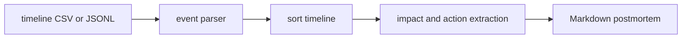

# postmortem-drafter

`postmortem-drafter` converts an incident timeline export into a concise Markdown
postmortem. It sorts events, summarizes impact, highlights root-cause language, lists
owners, and extracts action items.

## Why it is useful

Postmortems are often delayed because teams have to turn scattered timeline notes into a
reviewable document. This CLI handles the mechanical first draft so engineers can focus on
accuracy, accountability, and follow-up quality.

## Key features

- reads CSV or JSONL incident timelines
- sorts events by timestamp
- extracts unique customer-impact statements
- highlights root-cause and contributing-signal wording
- converts action-like events into checklist items
- writes a ready-to-edit Markdown postmortem

## Installation

```bash
python -m pip install -e ".[dev]"
```

## Usage

```bash
postmortem-drafter examples/timeline.csv --title "Checkout incident"
postmortem-drafter examples/timeline.csv --out postmortem.md
postmortem-drafter timeline.jsonl --format jsonl --title "API latency incident"
python -m postmortem_drafter --help
```

Expected CSV headers include `timestamp`, `type`, `summary`, `owner`, and `impact`.
JSONL accepts the same names, plus aliases like `kind`, `message`, and `customer_impact`.

## Workflow



## Tests

```bash
ruff check .
pytest
python -m postmortem_drafter --help
```

## License

MIT

