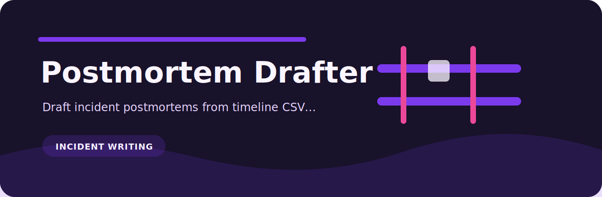

# Postmortem Drafter

<p align="center">
  
</p>

Draft incident postmortems from timeline CSV or JSONL exports.

## Working notes

- quick local checks around incident writing
- small CI jobs where a readable report is enough
- review workflows that need deterministic output
- examples based on `examples/timeline.csv`

## Install

```bash
git clone https://github.com/mertefekurt/postmortem-drafter.git
cd postmortem-drafter
python -m venv .venv
source .venv/bin/activate
python -m pip install -e ".[dev]"
```

## Use

```bash
postmortem-drafter examples/timeline.csv
```

## Files

```text
.github/        CI workflow
examples/       sample inputs
src/            package source
tests/          test coverage
.gitignore      project file
pyproject.toml  package metadata
```
