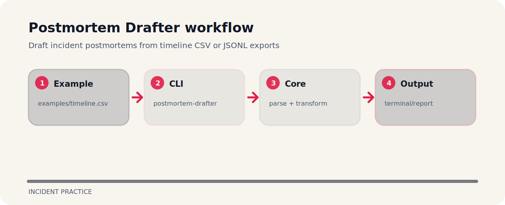

# Postmortem Drafter


Draft incident postmortems from timeline CSV or JSONL exports. It is a compact working note as much as a project: commands, file map, and the reasoning are kept close together.

## Working map



## Start here

```bash
git clone https://github.com/mertefekurt/postmortem-drafter.git
cd postmortem-drafter
python -m pip install -e ".[dev]"
postmortem-drafter examples/timeline.csv
```

## Why this shape

The shape of the repo is deliberate:

- Designed as a focused incident practice repo.
- Keeps setup short.
- Prioritizes readable output over infrastructure.

## Maintenance rhythm

```bash
ruff check .
pytest
python -m postmortem_drafter --help
```
